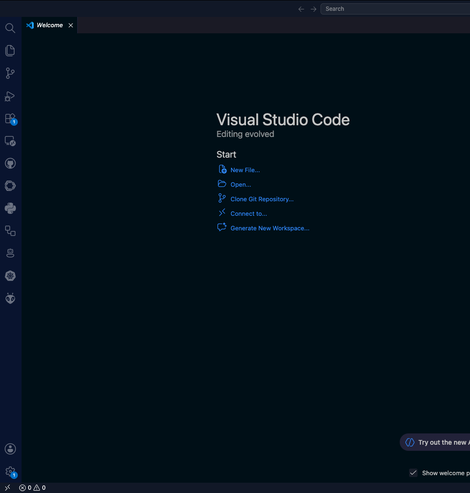
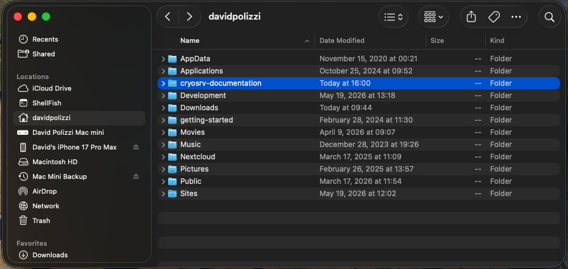

# Need A Header

<figure markdown="span">
  { width="300" }
  <figcaption>open-application.png</figcaption>
</figure>

<figure markdown="span">
  { width="300" }
  <figcaption>This is a better description.</figcaption>
</figure>

---

Is this something that should happen every time?

!!! danger

    If you dont unplug the compressor it can shock you.
